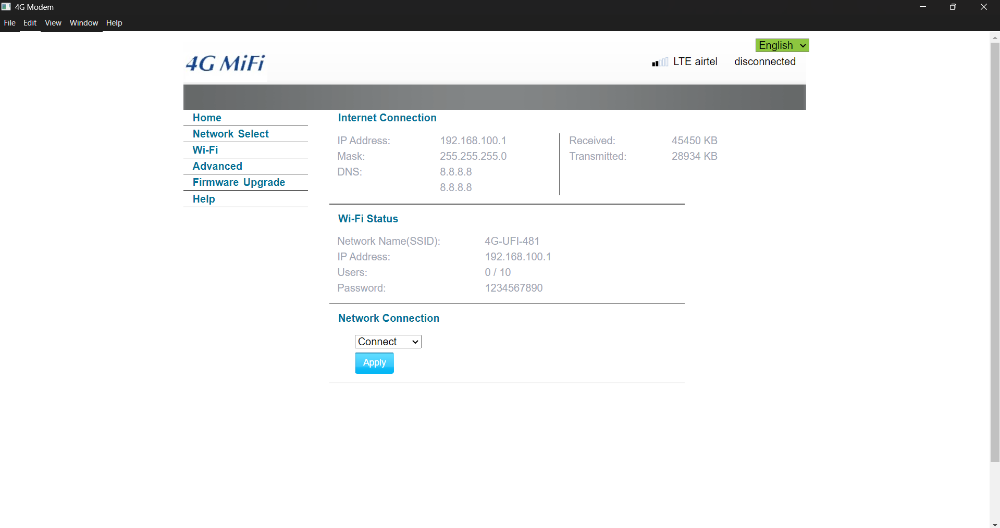
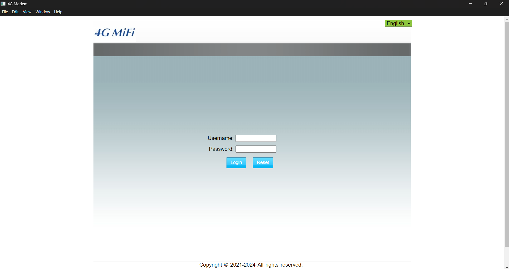

# 4G-LTE-V2.3.12
 This Windows app create for 4G-LTE-V2.3.12 WiFi dongle

1.1 Install Node.js and npm
1.2 Verify Installation
1.3 Install Electron
1.4 Create a New Project Directory
1.5 Initialize a New Node.js Project
1.6 Install Electron as a Development Dependency
1.7 Create the Basic Electron Application Structure

    main.js: This will be the main process script for your Electron application.
    index.html: This will be the HTML file that Electron will load in the main window.
    renderer.js: This will be the script that runs in the renderer process (optional for now).
    preload.js: This will be the script that runs in the preload process (optional for now).
    package.json: This will be the file that contains your Electron application's metadata and dependencies.
    package-lock.json: This will be the file that contains the exact versions of your Electron application's dependencies.
    --All the files updated in this repository--

1.8 Basic Electron Application Code
1.9 Update package.json
1.10 Run Your Electron Application

2.1 Enhance the Main Process (main.js)
2.2 Create a Preload Script (preload.js)
2.3 Enhance the Renderer Process (renderer.js)
2.4 Update the HTML (index.html)
2.5 Test the Application

3.1 Install Electron Builder
3.2 Update package.json for Packaging
3.3 Add Application Icons    
3.4 Package the Application
3.5 Platform-Specific Builds

